# 🚀 Quiz Generator V2 – Phân Tích NÂNG CẤP Toàn Diện

> [!IMPORTANT]
> **Triết lý:** Đáp ứng 100% yêu cầu đề bài + thêm **15 tính năng AI nâng cao** để gây WOW cho thầy.
> Mọi tính năng thêm đều xoay quanh **AI** – đúng trọng tâm đề thi.

---

## 📊 Bản Đồ Tính Năng Tổng Thể

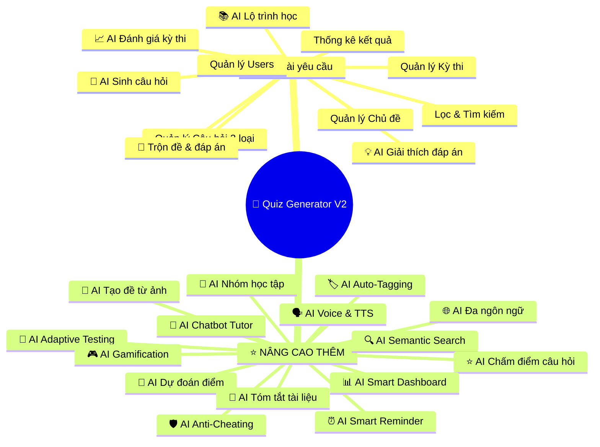

---

## 🔥 PHẦN 1: Tính Năng Đề Bài Yêu Cầu (Nền tảng)

> Giữ nguyên toàn bộ từ bản phân tích V1 – đảm bảo 100% đáp ứng.

| # | Tính năng | Loại | Trạng thái |
|---|---|---|---|
| 1 | Quản lý người dùng (CRUD, roles) | Cơ bản | ✅ Giữ nguyên |
| 2 | Quản lý chủ đề học tập | Cơ bản | ✅ Giữ nguyên |
| 3 | Quản lý câu hỏi (single/multi/fill-in) | Cơ bản | ✅ Giữ nguyên |
| 4 | Quản lý lượt thi | Cơ bản | ✅ Giữ nguyên |
| 5 | Thống kê đánh giá kết quả | Cơ bản | ✅ Giữ nguyên |
| 6 | Lọc & tìm kiếm câu hỏi theo chủ đề | Cơ bản | ✅ Giữ nguyên |
| 7 | AI sinh câu hỏi từ nội dung/tài liệu | Nâng cao | ✅ Giữ nguyên |
| 8 | Trộn câu hỏi & đáp án tự động | Nâng cao | ✅ Giữ nguyên |
| 9 | AI đánh giá kết quả thi | Nâng cao | ✅ Giữ nguyên |
| 10 | AI tóm tắt & đề xuất lộ trình học | Nâng cao | ✅ Giữ nguyên |
| 11 | AI giải thích đáp án | Nâng cao | ✅ Giữ nguyên |

---

## ⭐ PHẦN 2: 15 Tính Năng AI NÂNG CAO (Vượt Đề Bài)

---

### 🎯 Feature 1: AI Adaptive Testing (Thi Thích Ứng Thông Minh)

> **Ý tưởng:** Đề thi tự động điều chỉnh độ khó dựa trên câu trả lời của thí sinh. Trả lời đúng → câu khó hơn. Trả lời sai → câu dễ hơn. Giống như thi TOEFL/GRE thật.

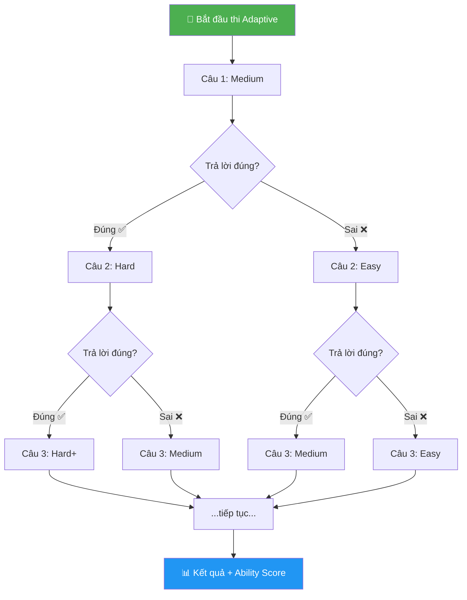

**Cách hoạt động:**
- Dùng thuật toán **IRT (Item Response Theory)** đơn giản hóa
- AI chọn câu hỏi tiếp theo dựa trên `abilityScore` hiện tại của thí sinh
- Kết quả không chỉ là điểm mà còn là **mức năng lực** (ability level)
- Giáo viên có thể bật/tắt mode adaptive cho mỗi bài thi

```javascript
// Logic Adaptive Testing
async function getNextQuestion(attemptId, currentAbility) {
  const attempt = await ExamAttempt.findById(attemptId);
  const answeredIds = attempt.answers.map(a => a.questionId);
  
  // Tính target difficulty dựa trên ability hiện tại
  let targetDifficulty;
  if (currentAbility > 0.7) targetDifficulty = 'hard';
  else if (currentAbility > 0.4) targetDifficulty = 'medium';
  else targetDifficulty = 'easy';
  
  // Chọn câu hỏi phù hợp chưa trả lời
  const nextQuestion = await Question.findOne({
    _id: { $nin: answeredIds },
    topicId: attempt.exam.topicId,
    difficulty: targetDifficulty
  });
  
  return nextQuestion;
}
```

---

### 🤖 Feature 2: AI Chatbot Tutor (Trợ Giảng AI)

> **Ý tưởng:** Chatbot AI luôn sẵn sàng ở góc màn hình. Sinh viên có thể hỏi bất kỳ câu hỏi nào về chủ đề đang học, AI sẽ trả lời như một gia sư riêng.

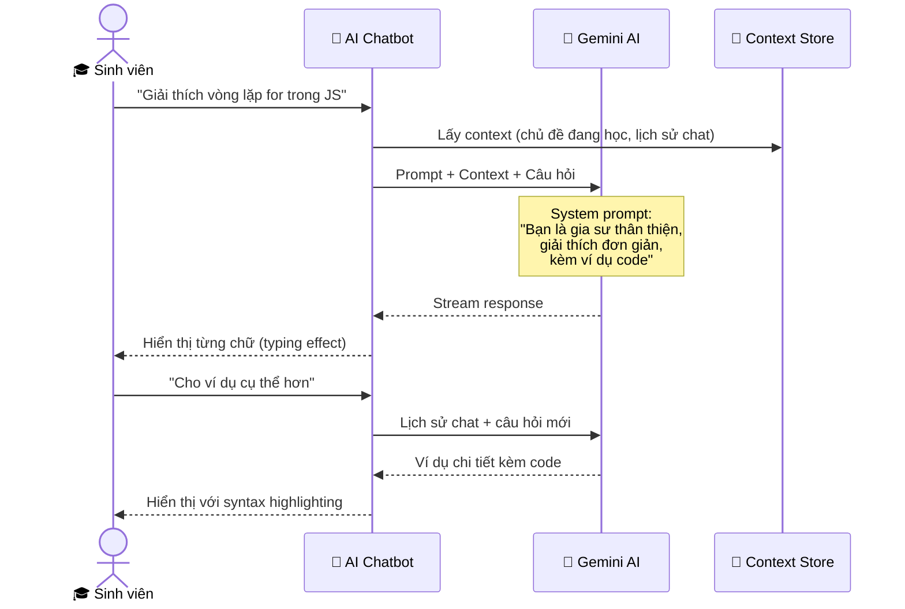

**Tính năng chatbot:**
- 💬 Chat realtime với typing animation (streaming)
- 📚 Context-aware: Biết sinh viên đang học chủ đề gì
- 🔄 Nhớ lịch sử hội thoại trong phiên
- 📝 Có thể hỏi về câu hỏi vừa làm sai
- 🎓 Tone giảng giải thân thiện, dễ hiểu
- 💡 Gợi ý "Bạn có muốn hỏi thêm về...?"

---

### 🛡️ Feature 3: AI Anti-Cheating (Phát Hiện Gian Lận)

> **Ý tưởng:** Hệ thống giám sát hành vi thí sinh trong lúc thi, phát hiện các dấu hiệu gian lận.

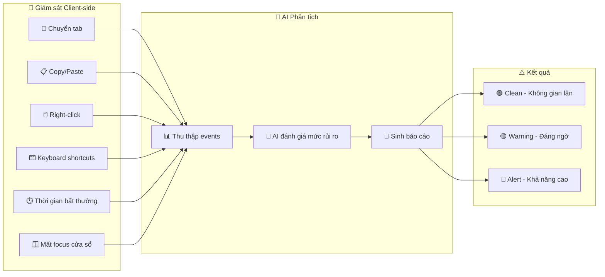

**Events được track:**
```javascript
const CHEATING_EVENTS = {
  TAB_SWITCH: { weight: 3, description: 'Chuyển tab/cửa sổ' },
  COPY_PASTE: { weight: 5, description: 'Copy/Paste nội dung' },
  RIGHT_CLICK: { weight: 1, description: 'Click chuột phải' },
  WINDOW_BLUR: { weight: 2, description: 'Mất focus window' },
  UNUSUAL_IDLE: { weight: 2, description: 'Không hoạt động > 60s rồi trả lời nhanh' },
  RAPID_ANSWER: { weight: 4, description: 'Trả lời quá nhanh (< 3s/câu hard)' },
  ANSWER_PATTERN: { weight: 3, description: 'Pattern đáp án giống người khác bất thường' }
};
```

**AI phân tích và đưa ra:**
- **Risk Score** (0-100): Mức độ nghi ngờ
- **Detailed Report**: Liệt kê các sự kiện bất thường
- **Recommendation**: Nên review hay chấp nhận kết quả

---

### 🔮 Feature 4: AI Performance Prediction (Dự Đoán Điểm)

> **Ý tưởng:** Trước khi thi, AI dự đoán điểm số sinh viên dựa trên lịch sử học tập. Sau khi thi xong, so sánh dự đoán vs thực tế.

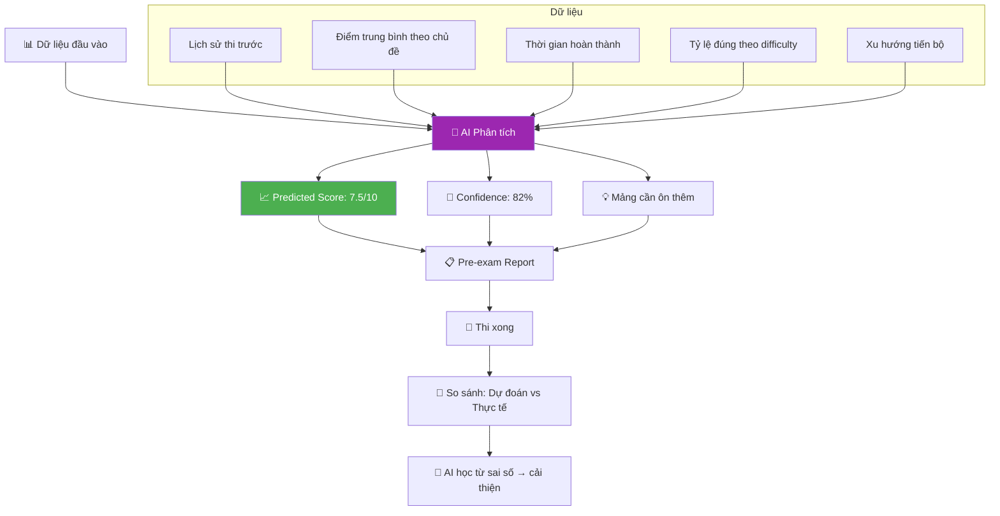

**Prompt cho Gemini:**
```
Dựa trên lịch sử học tập của sinh viên:
- 5 lần thi gần nhất: [scores]
- Tỷ lệ đúng theo mức độ: easy: 90%, medium: 65%, hard: 30%
- Chủ đề sắp thi: "JavaScript Advanced"
- Số câu hỏi: 30 (10 easy, 12 medium, 8 hard)

Hãy dự đoán:
1. Điểm dự kiến (khoảng tin cậy)
2. Xác suất pass (>= 5/10)
3. Câu hỏi nào khả năng sai cao nhất
4. Đề xuất ôn tập 24h trước thi
```

---

### 🔍 Feature 5: AI Semantic Search (Tìm Kiếm Ngữ Nghĩa)

> **Ý tưởng:** Thay vì tìm kiếm keyword đơn giản, dùng AI để hiểu ý nghĩa câu hỏi tìm kiếm.

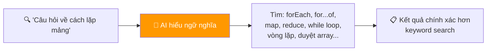

**Cách triển khai:**
- User nhập query bằng ngôn ngữ tự nhiên
- Gemini AI phân tích query → trích xuất keywords + synonyms
- Tìm kiếm mở rộng trong database
- Xếp hạng kết quả theo **relevance score**

```javascript
// AI-enhanced search
async function semanticSearch(query, topicId) {
  // Bước 1: AI phân tích query
  const aiAnalysis = await gemini.generateContent(`
    Phân tích câu tìm kiếm: "${query}"
    Trả về JSON:
    {
      "keywords": ["keyword1", "keyword2"],
      "synonyms": ["synonym1", "synonym2"],
      "intent": "mô tả ý định tìm kiếm",
      "relatedConcepts": ["concept1", "concept2"]
    }
  `);
  
  const { keywords, synonyms, relatedConcepts } = JSON.parse(aiAnalysis);
  
  // Bước 2: Tìm kiếm mở rộng
  const allTerms = [...keywords, ...synonyms, ...relatedConcepts];
  const results = await Question.find({
    topicId,
    $or: allTerms.map(term => ({
      questionText: { $regex: term, $options: 'i' }
    }))
  });
  
  return results;
}
```

---

### 🏷️ Feature 6: AI Auto-Tagging & Categorization

> **Ý tưởng:** Khi tạo câu hỏi (thủ công hoặc AI sinh), hệ thống tự động gán tag, phân loại độ khó, và xác định kiến thức liên quan.

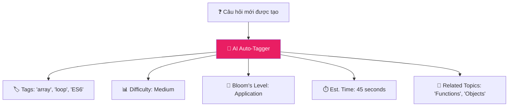

**Bloom's Taxonomy Levels (AI phân loại):**
| Level | Mô tả | Ví dụ |
|---|---|---|
| Remember | Ghi nhớ | "Từ khóa nào khai báo biến trong JS?" |
| Understand | Hiểu | "Giải thích sự khác nhau giữa let và var" |
| Apply | Áp dụng | "Viết code dùng map() để nhân đôi mảng" |
| Analyze | Phân tích | "Tại sao code này bị lỗi?" |
| Evaluate | Đánh giá | "Cách nào tối ưu hơn và tại sao?" |
| Create | Sáng tạo | "Thiết kế giải pháp cho bài toán..." |

---

### 🎮 Feature 7: AI Gamification System

> **Ý tưởng:** AI tạo hệ thống game hóa thông minh – badges, streaks, leaderboard, challenges được cá nhân hóa.

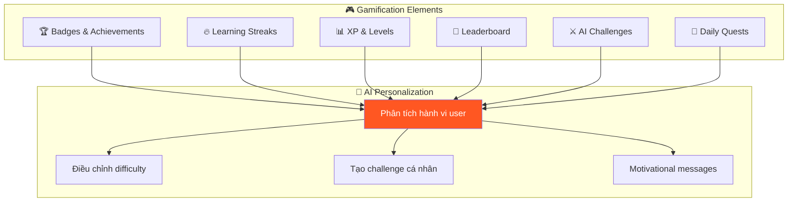

**Badges mẫu:**
| Badge | Điều kiện | Icon |
|---|---|---|
| 🌟 First Steps | Hoàn thành bài thi đầu tiên | ⭐ |
| 🔥 On Fire | Streak 7 ngày liên tiếp | 🔥 |
| 🧠 Brain Power | Đạt 100% bài thi khó | 🧠 |
| ⚡ Speed Demon | Hoàn thành < 50% thời gian | ⚡ |
| 📚 Scholar | Hoàn thành 50 bài thi | 📚 |
| 🏆 Champion | Top 1 leaderboard | 🏆 |
| 🤖 AI Explorer | Sử dụng AI Tutor 10 lần | 🤖 |

**AI Daily Quests:**
- AI tạo 3 "nhiệm vụ hàng ngày" dựa trên mảng yếu của user
- VD: *"Hôm nay hãy làm 5 câu về Vòng lặp (mảng yếu nhất của bạn)"*
- Hoàn thành quest → nhận XP bonus

---

### 👥 Feature 8: AI Collaborative Learning Groups

> **Ý tưởng:** AI tự động nhóm sinh viên có điểm yếu giống nhau thành study groups, đề xuất bài tập nhóm.

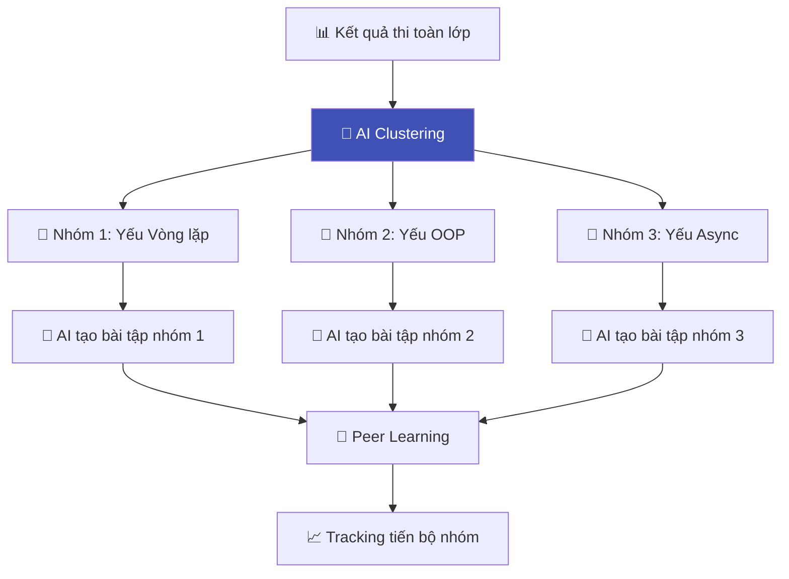

**AI phân nhóm dựa trên:**
- Mảng kiến thức yếu giống nhau
- Trình độ tương đương (không quá chênh lệch)
- Mỗi nhóm 3-5 người
- AI tạo bài tập phù hợp cho cả nhóm

---

### 🗣️ Feature 9: AI Voice & Accessibility

> **Ý tưởng:** Tích hợp Text-to-Speech để đọc câu hỏi, hỗ trợ sinh viên khuyết tật hoặc thích nghe hơn đọc.

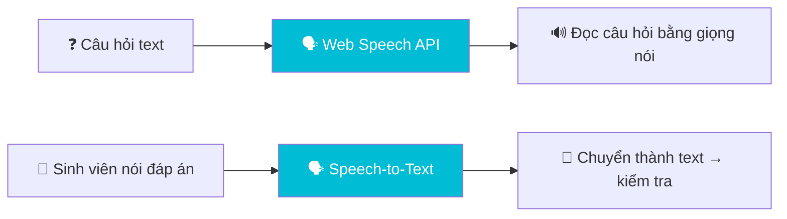

**Tính năng:**
- 🔊 **Đọc câu hỏi**: Click nút → AI đọc câu hỏi bằng giọng Việt
- 🎤 **Trả lời bằng giọng nói**: Cho câu hỏi dạng fill-in
- 🔤 **Font size adjustment**: Tăng/giảm cỡ chữ
- 🌗 **High contrast mode**: Cho người khiếm thị
- ⌨️ **Full keyboard navigation**: Thi không cần chuột

---

### 📄 Feature 10: AI Document Summarizer (Tóm Tắt Tài Liệu)

> **Ý tưởng:** Trước khi sinh câu hỏi, AI tóm tắt tài liệu upload thành outline dễ hiểu, cho giáo viên review nội dung.

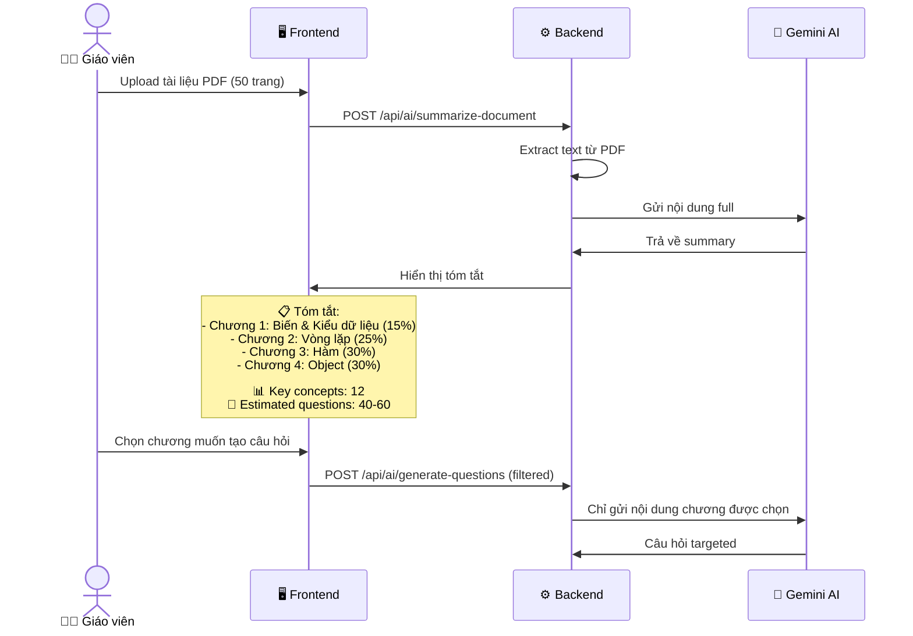

**Output tóm tắt mẫu:**
```json
{
  "title": "Lập trình JavaScript Cơ bản",
  "totalPages": 50,
  "chapters": [
    {
      "name": "Chương 1: Biến & Kiểu dữ liệu",
      "summary": "Giới thiệu var/let/const, primitive types...",
      "keyConcepts": ["hoisting", "scope", "type coercion"],
      "estimatedQuestions": 12,
      "contentWeight": 15
    }
  ],
  "overallSummary": "Tài liệu bao gồm 4 chương chính...",
  "suggestedQuestionDistribution": {
    "easy": 15, "medium": 25, "hard": 10
  }
}
```

---

### ⭐ Feature 11: AI Question Quality Scoring

> **Ý tưởng:** AI đánh giá chất lượng câu hỏi (do người tạo hoặc AI sinh) trước khi đưa vào bài thi.

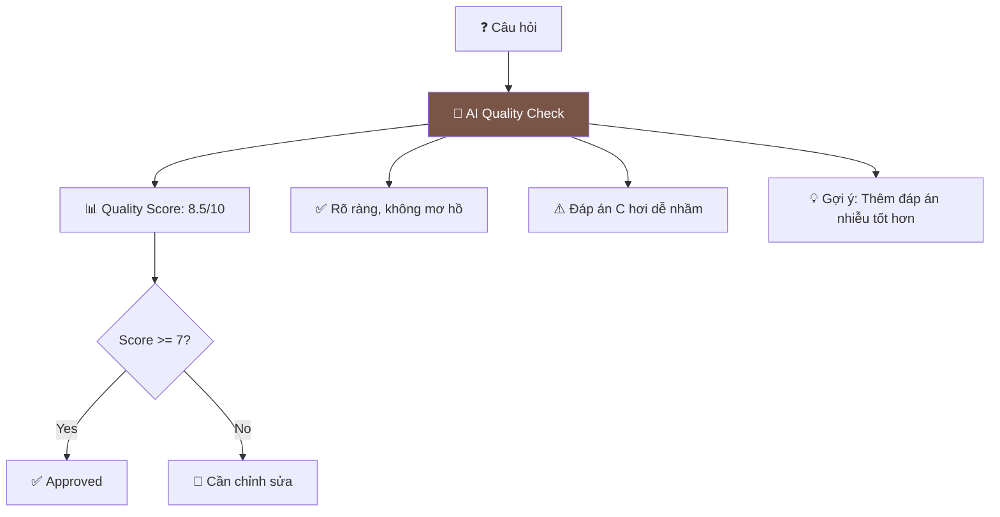

**Tiêu chí đánh giá:**
| Tiêu chí | Trọng số | Mô tả |
|---|---|---|
| Clarity | 25% | Câu hỏi rõ ràng, không mơ hồ |
| Accuracy | 25% | Đáp án đúng chính xác |
| Distractors | 20% | Đáp án sai có hợp lý (gây nhiễu tốt) |
| Difficulty Match | 15% | Độ khó phù hợp với label |
| Grammar | 15% | Ngữ pháp, chính tả đúng |

---

### 📊 Feature 12: AI Smart Analytics Dashboard

> **Ý tưởng:** Dashboard thống kê thông minh với AI insights, không chỉ số liệu mà còn **phân tích xu hướng** và **dự đoán**.

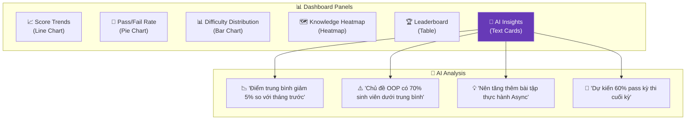

**AI Insights tự động generate:**
- 📉 **Trend Analysis**: So sánh với kỳ thi trước, phát hiện xu hướng
- ⚠️ **Risk Alerts**: Cảnh báo chủ đề có điểm thấp bất thường
- 💡 **Recommendations**: Đề xuất hành động cho giáo viên
- 🔮 **Predictions**: Dự đoán kết quả kỳ thi sắp tới

---

### 🌐 Feature 13: AI Multi-Language Question Generation

> **Ý tưởng:** AI có thể sinh câu hỏi bằng nhiều ngôn ngữ, hoặc dịch câu hỏi existing sang ngôn ngữ khác.

**Hỗ trợ:**
- 🇻🇳 Tiếng Việt (mặc định)
- 🇬🇧 English
- AI tự động dịch câu hỏi + đáp án giữa các ngôn ngữ
- Giữ nguyên tính chính xác chuyên ngành

---

### ⏰ Feature 14: AI Smart Reminders & Study Planner

> **Ý tưởng:** AI tạo lịch ôn tập thông minh dựa trên spaced repetition, gửi nhắc nhở đúng thời điểm.

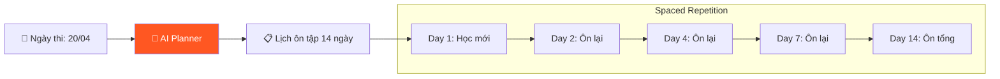

**AI Smart Reminder gửi:**
- 📧 Email nhắc nhở ôn tập
- 🔔 In-app notification
- 📊 *"Bạn đã ôn 60% nội dung, còn 5 ngày nữa thi"*
- 💡 *"Hôm nay nên ôn lại chủ đề Vòng lặp (bạn hay quên nhất)"*

---

### 📝 Feature 15: AI Generate Questions from Images

> **Ý tưởng:** Upload ảnh chụp sách, bảng, biểu đồ → AI phân tích ảnh và tạo câu hỏi từ nội dung trong ảnh.

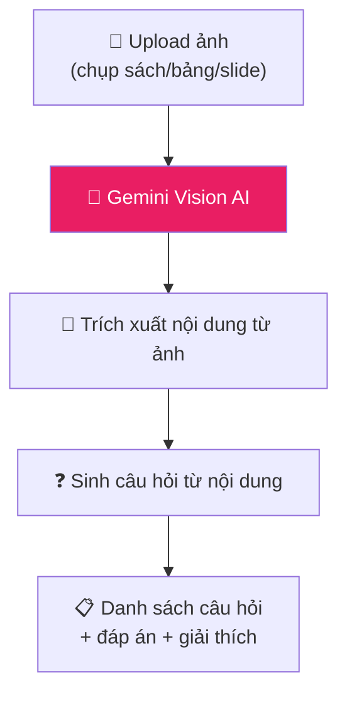

**Gemini Vision API hỗ trợ:**
- 📸 Ảnh chụp trang sách
- 📊 Biểu đồ, đồ thị
- 📐 Công thức toán
- 💻 Code screenshots
- 📋 Slides bài giảng

---

## 🏗️ PHẦN 3: Kiến Trúc Nâng Cấp

### Database Schema Bổ Sung

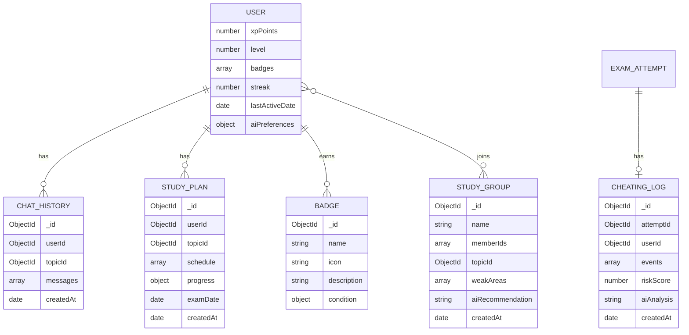

### API Endpoints Bổ Sung

| Method | Endpoint | Mô tả | Feature |
|---|---|---|---|
| POST | `/api/ai/adaptive-next` | Lấy câu hỏi tiếp (adaptive) | 🎯 F1 |
| POST | `/api/ai/chat` | Chat với AI Tutor | 🤖 F2 |
| GET | `/api/ai/chat/history` | Lịch sử chat | 🤖 F2 |
| POST | `/api/ai/cheating-report/:attemptId` | Báo cáo gian lận | 🛡️ F3 |
| GET | `/api/ai/predict/:userId/:examId` | Dự đoán điểm | 🔮 F4 |
| POST | `/api/ai/semantic-search` | Tìm kiếm ngữ nghĩa | 🔍 F5 |
| POST | `/api/ai/auto-tag` | Auto tag câu hỏi | 🏷️ F6 |
| GET | `/api/gamification/badges` | Danh sách badges | 🎮 F7 |
| GET | `/api/gamification/leaderboard` | Bảng xếp hạng | 🎮 F7 |
| POST | `/api/ai/group-students` | AI phân nhóm | 👥 F8 |
| POST | `/api/ai/summarize-doc` | Tóm tắt tài liệu | 📄 F10 |
| POST | `/api/ai/quality-check` | Chấm chất lượng câu hỏi | ⭐ F11 |
| GET | `/api/ai/smart-insights/:examId` | AI insights | 📊 F12 |
| POST | `/api/ai/generate-from-image` | Sinh câu hỏi từ ảnh | 📝 F15 |
| GET | `/api/ai/study-plan/:userId` | Lịch ôn tập AI | ⏰ F14 |

---

## 🏗️ PHẦN 4: Cấu Trúc Thư Mục Nâng Cấp

```
quiz-generator/
├── 📁 client/                          # Frontend (Next.js 14)
│   ├── 📁 app/
│   │   ├── 📁 (auth)/                 # Login, Register
│   │   ├── 📁 dashboard/              # Dashboard chính
│   │   ├── 📁 topics/                 # CRUD chủ đề
│   │   ├── 📁 questions/              # CRUD câu hỏi
│   │   ├── 📁 exams/                  # CRUD bài thi
│   │   ├── 📁 take-exam/              # Giao diện thi
│   │   │   └── 📁 [id]/
│   │   │       ├── page.js            # Normal mode
│   │   │       └── adaptive/page.js   # ⭐ Adaptive mode
│   │   ├── 📁 results/                # Kết quả
│   │   │   └── 📁 [id]/
│   │   │       ├── page.js            # Kết quả chi tiết
│   │   │       ├── ai-review/page.js  # ⭐ AI đánh giá
│   │   │       └── explain/page.js    # ⭐ AI giải thích
│   │   ├── 📁 ai/                     # ⭐ Tất cả trang AI
│   │   │   ├── generate/page.js       # Sinh câu hỏi
│   │   │   ├── generate-image/page.js # ⭐ Sinh từ ảnh
│   │   │   ├── summarize/page.js      # ⭐ Tóm tắt doc
│   │   │   └── quality-check/page.js  # ⭐ Chấm chất lượng
│   │   ├── 📁 learning-path/          # ⭐ Lộ trình AI
│   │   ├── 📁 study-plan/             # ⭐ Lịch ôn tập
│   │   ├── 📁 study-groups/           # ⭐ Nhóm học tập
│   │   ├── 📁 stats/                  # Thống kê
│   │   │   ├── page.js                # Overview
│   │   │   └── 📁 [examId]/
│   │   │       └── page.js            # ⭐ AI Smart Analytics
│   │   ├── 📁 leaderboard/            # ⭐ Bảng xếp hạng
│   │   ├── 📁 profile/                # Profile + Badges
│   │   ├── 📁 admin/                  # Admin panel
│   │   │   ├── users/page.js
│   │   │   └── cheating/page.js       # ⭐ Anti-cheat reports
│   │   ├── layout.js
│   │   └── page.js                    # Landing page
│   ├── 📁 components/
│   │   ├── 📁 ui/                     # Design system
│   │   ├── 📁 exam/                   # Exam components
│   │   ├── 📁 ai/                     # ⭐ AI components
│   │   │   ├── ChatBot.js             # AI Tutor chatbot
│   │   │   ├── ExplanationBox.js      # Giải thích đáp án
│   │   │   ├── QualityBadge.js        # Quality score badge
│   │   │   ├── PredictionCard.js      # Dự đoán điểm
│   │   │   └── InsightCard.js         # AI insight card
│   │   ├── 📁 gamification/           # ⭐ Gamification
│   │   │   ├── BadgeDisplay.js
│   │   │   ├── StreakCounter.js
│   │   │   ├── XPBar.js
│   │   │   └── LevelBadge.js
│   │   ├── 📁 charts/                 # Charts
│   │   └── 📁 layout/                 # Layout components
│   │       ├── Navbar.js
│   │       ├── Sidebar.js
│   │       └── ChatWidget.js          # ⭐ Floating chatbot
│   └── 📁 lib/
│       ├── api.js
│       └── utils.js
│
├── 📁 server/                          # Backend (Express.js)
│   ├── 📁 config/
│   │   ├── db.js
│   │   └── gemini.js                  # Gemini AI config
│   ├── 📁 models/
│   │   ├── User.js
│   │   ├── Topic.js
│   │   ├── Question.js
│   │   ├── Exam.js
│   │   ├── ExamAttempt.js
│   │   ├── AILog.js
│   │   ├── ChatHistory.js             # ⭐
│   │   ├── CheatingLog.js             # ⭐
│   │   ├── StudyPlan.js               # ⭐
│   │   ├── StudyGroup.js              # ⭐
│   │   └── Badge.js                   # ⭐
│   ├── 📁 routes/
│   │   ├── auth.js
│   │   ├── users.js
│   │   ├── topics.js
│   │   ├── questions.js
│   │   ├── exams.js
│   │   ├── attempts.js
│   │   ├── stats.js
│   │   ├── ai.js                      # ⭐ Core AI routes
│   │   └── gamification.js            # ⭐ Gamification routes
│   ├── 📁 controllers/
│   │   ├── ...basic controllers...
│   │   ├── aiController.js            # ⭐ Extended
│   │   └── gamificationController.js  # ⭐
│   ├── 📁 services/
│   │   ├── aiService.js               # ⭐ Core AI (Gemini)
│   │   ├── adaptiveService.js         # ⭐ Adaptive testing
│   │   ├── cheatingService.js         # ⭐ Anti-cheat
│   │   ├── chatbotService.js          # ⭐ AI Tutor
│   │   ├── predictionService.js       # ⭐ Score prediction
│   │   ├── gamificationService.js     # ⭐ XP, badges
│   │   ├── groupingService.js         # ⭐ Study groups
│   │   ├── shuffleService.js          # Trộn đề
│   │   ├── fileService.js             # PDF/DOCX parser
│   │   └── statsService.js            # Thống kê
│   ├── 📁 middleware/
│   │   ├── auth.js
│   │   ├── roleCheck.js
│   │   ├── upload.js
│   │   └── cheatingTracker.js         # ⭐ Track cheating events
│   ├── 📁 utils/
│   │   ├── prompts.js                 # ⭐ All AI prompts
│   │   └── helpers.js
│   └── server.js
│
├── .env
├── package.json
└── README.md
```

---

## 🎯 PHẦN 5: Tóm Tắt So Sánh

### Đề bài yêu cầu vs Dự án của chúng ta:

| | Đề bài yêu cầu | 🚀 Dự án của chúng ta |
|---|---|---|
| **CRUD cơ bản** | ✅ User, Topic, Question, Exam | ✅ + StudyGroup, Badge, StudyPlan |
| **Loại câu hỏi** | 3 loại | 3 loại + AI auto-detect type |
| **AI sinh câu hỏi** | Từ text/file | ✅ + từ ảnh (Vision AI) + tóm tắt trước |
| **Trộn đề** | Cơ bản | ✅ + Adaptive Testing (IRT) |
| **Đánh giá kỳ thi** | Thống kê cơ bản | ✅ + AI Insights + Predictions + Trends |
| **Lộ trình học** | Đề xuất chung | ✅ + Spaced Repetition + Study Planner |
| **Giải thích đáp án** | Sau khi thi | ✅ + Real-time + AI Chatbot Tutor |
| **Anti-cheat** | ❌ Không yêu cầu | ✅ AI Proctoring |
| **Gamification** | ❌ Không yêu cầu | ✅ XP, Badges, Streaks, Leaderboard |
| **Accessibility** | ❌ Không yêu cầu | ✅ Voice, TTS, Keyboard nav |
| **Smart Search** | Keyword cơ bản | ✅ AI Semantic Search |
| **Quality Control** | ❌ Không yêu cầu | ✅ AI Question Quality Scoring |

> [!CAUTION]
> **Lưu ý quan trọng:** Không nên cố làm TẤT CẢ 15 features nâng cao nếu thời gian có hạn. Nên ưu tiên:
> 1. ✅ Hoàn thành 100% yêu cầu đề bài trước
> 2. ⭐ Chọn 5-7 features nâng cao ấn tượng nhất
> 3. 🎨 Polish UI/UX cho đẹp

### 🏆 Top 7 Features Nên Ưu Tiên (Impact cao nhất):

| # | Feature | Lý do ưu tiên |
|---|---|---|
| 1 | 🤖 AI Chatbot Tutor | WOW factor cao, demo ấn tượng |
| 2 | 📝 AI Sinh câu hỏi từ ảnh | Gemini Vision = công nghệ mới nhất |
| 3 | 🎯 Adaptive Testing | Thể hiện hiểu biết sâu về EdTech |
| 4 | 🛡️ AI Anti-Cheating | Thực tế, giáo viên sẽ rất thích |
| 5 | 🎮 Gamification | UI đẹp, sinh viên thích |
| 6 | 📊 AI Smart Dashboard | Thống kê ấn tượng với insights |
| 7 | 📄 AI Document Summarizer | Thực dụng, dễ demo |
